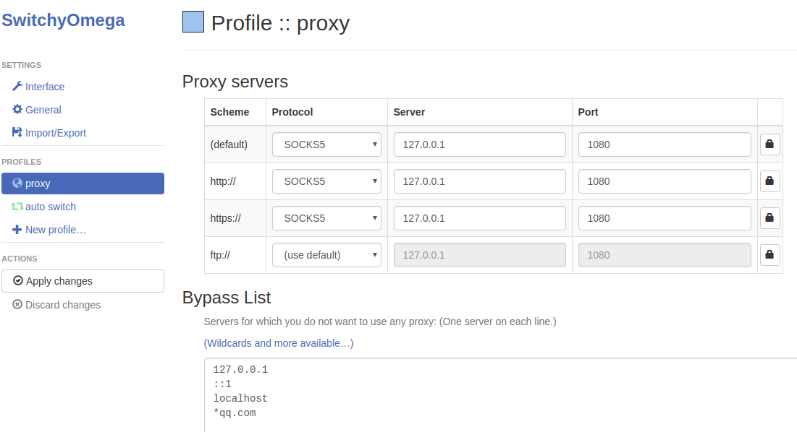

Prepare
=======
- [Build your own ss/ssr server tutorial](https://github.com/XX-net/XX-Net/issues/6506)(suitable for beginners, minimum $2.5/month)
- [Build your own ss/ssr server tutorial](http://feelsight.cn/post/68.html) (suitable for beginners, not afraid of IP firewall)

Buy VPS
=======
Whether [hostodo](https://hostodo.com) or [HostUS](https://hostus.us/openvz-vps.html), choose the US West VPS, such as LA (Los Angeles)
- hard details: [how to build a SSR ladder](https://www.lovexyh.top/archives/129) (VPN) + BBR acceleration (hostodo)
- [Self-built VPN to build Shadowsocks server Internet Raiders](http://xeworld.com/post/setup-shadowsocks-vpn/) (HostUS) 

SSR server configuration
========================

On virtual machine
------------------
- [Ubuntu16.04 build SSR server](https://www.lstazl.com/ubuntu16-04%E6%90%AD%E5%BB%BAssr%E6%9C%8D%E5%8A%A1%E5%99%A8%E9%94%90%E9%80%9F/) + ServerSpeeder
- [CentOS 6/7 supports the installation of a ServerSpeeder kernel](https://www.wn789.com/4689.html)
- [LotServer (ServerSpeeder parent company) - Linux TCP acceleration tool one-click installation script](https://uixsj.cn/1465.html)

On container
------------
- [OpenVZ architecture VPS installation BBR one-button package](https://www.cmsky.com/openvz-bbr-onekey/)
- [OpenVZ's VPS, using BBR like ServerSpeeder acceleration optimization](https://blog.janfou.com/technical-documents/13084.html)

About TCP acceleration:
-----------------------
- [Tencent unilateral congestion algorithm TCPA](https://blog.csdn.net/jsdtwyk/article/details/88380763)


SSR server on VPS
=================
Buy a VPS
- install ssr
```
wget -N --no-check-certificate https://raw.githubusercontent.com/ToyoDAdoubi/doubi/master/ssr.sh && chmod +x ssr.sh && bash ssr.sh
```
or
```
wget -N --no-check-certificate https://softs.fun/Bash/ssr.sh && chmod +x ssr.sh && bash ssr.sh
```
- install BBR
```
wget --no-check-certificate https://github.com/91yun/uml/raw/master/lkl/install.sh && bash install.sh
```

Ubuntu SSR client
=================

Just run [ubuntu_set_ssr.sh](./ubuntu_set_ssr.sh) once
```
SERVER=1.2.3.3 PORT=2333 PASS=123456 PROTOCOL=auth_sha1_v4 OBFS=plain METHOD=aes-128-ctr ./ubuntu_set_ssr.sh
```
Start the proxy:
```
ssr-proxy restart
```

Chrome install SwitchyOmega proxy
=================================
- Start chrome
```
/opt/google/chrome/chrome --enable-easy-off-store-extension-install
```

- Open **chrome://extensions/** in chrome
- Download SwitchyOmega
```
KSURL=https://github.com/FelisCatus/SwitchyOmega/releases/latest
VERSION=`curl -Ls -w %{url_effective} -o /dev/null $KSURL`
VERSION=${VERSION##*/}
wget https://github.com/FelisCatus/SwitchyOmega/releases/download/$VERSION/SwitchyOmega_Chromium.crx
nautilus $PWD
xdg-open $PWD
```
- move SwitchyOmega_Chromium.crx to chrome **chrome://extensions/** page
- click the **blue circle** on the right corner of chrome. 
- click **"Options"** 
- click **"proxy"**
- Protocol choose "SOCKS5", server input **"127.0.0.1"**, port input **1080**
